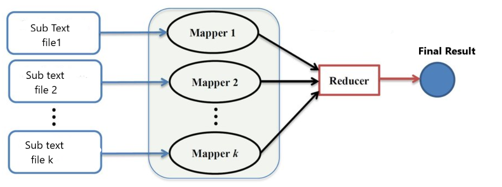

# Map Reduce

 


The goal of this project is to reproduce the behavior of Hadoop on the example of
word count seen in class labs. So I must design a distributed word counting platform
based on map-reduce (to be programmed with Sockets or RMI ).This project must not use the platform of
Hadoop. 

- As input:  a set of text files containing words; 
- As output: a dictionary comprising all the words associated with the counter of their number of occurrences.
  
In a first phase, a stain by
file will count the number of occurrences of the words in the file it
received (MAP), secondly a fixed number of spots
"Reduce" will recover from each of the spots map the sub
set of words for which it is "responsible" and count for
each of these words, the total number of occurrences.

To test my platform you can take any web pages
and varying the number of machines
working in parallel.


 
# Table of content: 

[1. Modeling the problem]( #Modeling-the-problem)
[2. Installation]( #Installation)
[3. Steps of coding]( #Steps-of-coding)

## Modeling the problem

#### This diagram discribes how a mapreduce program works 


#### This diagram represents how I designed my program


I created a java class VM which is the mapper in my program. Each VM object is attributed to a port form 3000 to 3000+k.
The reducer in my program is the MachineReducer class. It's responsible to do reducing.

## Installation 


```
$ git clone https://github.com/Rafii-Ayoub/Map-Reduce

```

## Steps of coding

