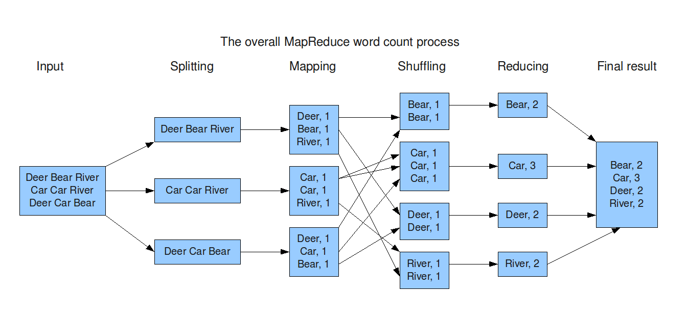

# Map Reduce

 


The goal of this project is to reproduce the behavior of Hadoop on the example of
word count seen in class labs. So I must design a distributed word counting platform
based on map-reduce (to be programmed with Sockets or RMI ).This project must not use the platform of
Hadoop. 

- As input:  a set of text files containing words; 
- As output: a dictionary comprising all the words associated with the counter of their number of occurrences.
  
In a first phase, a stain by
file will count the number of occurrences of the words in the file it
received (MAP), secondly a fixed number of spots
"Reduce" will recover from each of the spots map the sub
set of words for which it is "responsible" and count for
each of these words, the total number of occurrences.

To test my platform you can take any web pages
and varying the number of machines
working in parallel.


 
# Table of content: 

1.[ Modeling the problem]( #Modeling-the-problem)
2.[ Installation]( #Installation)
3.[ Steps of coding]( #Steps-of-coding)

## Modeling the problem

#### The MapReduce process 

MapReduce is a programming model or pattern within the Hadoop framework that is used to access big data stored in the Hadoop File System (HDFS). It is a core component, integral to the functioning of the Hadoop framework.

MapReduce facilitates concurrent processing by splitting petabytes of data into smaller chunks, and processing them in parallel on Hadoop commodity servers. In the end, it aggregates all the data from multiple servers to return a consolidated output back to the application.


At the crux of MapReduce are two functions: Map and Reduce. They are sequenced one after the other.

- The Map function takes input from the disk as <key,value> pairs, processes them, and produces another set of intermediate <key,value> pairs as output.
- The Reduce function also takes inputs as <key,value> pairs, and produces <key,value> pairs as output.

The types of keys and values differ based on the use case. All inputs and outputs are stored in the HDFS. While the map is a mandatory step to filter and sort the initial data, the reduce function is optional.
'''
<k1, v1> -> Map() -> list(<k2, v2>)
<k2, list(v2)> -> Reduce() -> list(<k3, v3>)
'''
Mappers and Reducers are the Hadoop servers that run the Map and Reduce functions respectively. It doesn’t matter if these are the same or different servers.


#### How I designed my program

I created a Java class VM which is the mapper for my program. Each VM object is assigned to a port from 3000 to 3000 + k.
The reducer for my program is the MachineReducer class. He is responsible for making the reducing. The VMHandler is responsible for handling and managing the VM objects by giving each one the task of reading a subfile and doing the reducting. I have also created other classes to scrape web pages and parse html texts and extract text which will be splited into sub-texts.


## Installation 


```
$ git clone https://github.com/Rafii-Ayoub/Map-Reduce

```

## Steps of coding

